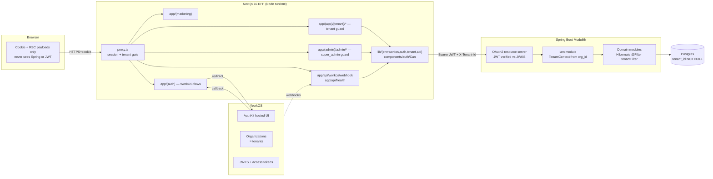

# Bizen Health Web — Architecture & Auth/Tenant Foundation (PR1)

## Context

`bizen-health-web` will be the web frontend for a hospital/clinic management SaaS, talking to a separate **Spring Boot Modulith** backend. Today the repo is a near-default Next.js 16.2.4 + React 19.2.4 + Tailwind v4 + TypeScript scaffold (`app/layout.tsx`, `app/page.tsx`, `app/globals.css`, plus husky/commitlint/lint-staged/prettier already wired in `package.json`). No app code or auth exists yet.

This plan locks in foundation only — architecture + auth + tenant model — so that clinical modules (patients, encounters, prescriptions, billing, scheduling) can land cleanly in later PRs.

### Decisions

| Decision         | Choice                                                                                                                                                        |
| ---------------- | ------------------------------------------------------------------------------------------------------------------------------------------------------------- |
| Tenant URL shape | Path-based: `app.bizen.health/<tenant-slug>/...`                                                                                                              |
| Auth provider    | **WorkOS AuthKit**, accessed only through `lib/workos.ts` adapter                                                                                             |
| Tenant primitive | **WorkOS Organization == 1 tenant**. Users may belong to multiple Organizations (WorkOS default) — `/<slug>` URL identifies the _active_ org for that request |
| Tenant id key    | BE `tenants` table is keyed on `workos_org_id` (single source of truth, no mirrored UUID)                                                                     |
| Mobile           | Deferred. JWT-based auth keeps RN/Capacitor option open                                                                                                       |

### Why WorkOS Organizations as the tenant primitive

Per-tenant SSO (SAML/OIDC), SCIM directory sync, scoped Audit Logs, first-class Roles, and HIPAA-eligible plan are all included — features hospitals will demand and that we'd otherwise build by hand.

### Next.js 16 facts that shape this plan (verified in `node_modules/next/dist/docs/`)

- `middleware.ts` → **`proxy.ts`** (function exported as `proxy`, default export also accepted). Edge runtime is **not** supported in proxy; runtime is Node and not configurable. (`02-guides/upgrading/version-16.md:625-650`, `03-api-reference/03-file-conventions/proxy.md:217-220`).
- `params` in layouts/pages, `searchParams`, `cookies()`, `headers()`, `draftMode()` are all **Promises** in Next 16. Synchronous access is fully removed (`version-16.md:294-306`).
- `LayoutProps<'/[tenant]'>` and `PageProps<'/[tenant]'>` helpers are auto-generated by `next typegen` and globally available — use them instead of hand-rolled types (`version-16.md:308-329`, `layout.md:93-110`).
- `fetch` is **not cached by default** in Next 16; opt in with `'use cache'` directive or explicit `cache:` (`01-getting-started/06-fetching-data.md:62-64`). Our BFF→Spring calls will be `cache: 'no-store'`.
- Server Functions are NOT separate routes — proxy matchers can silently miss them after refactors. **Always re-verify auth inside each Server Action** (`proxy.md:213-215`).
- `app/forbidden.tsx` is a built-in special file (Next 15.1+) rendered when `forbidden()` is called in a server component; returns a 403 (`forbidden.md`). We'll use it as-is rather than inventing a custom `/forbidden` route.

### Integration risk to validate first in PR1

`@workos-inc/authkit-nextjs` historically shipped `authkitMiddleware()` for `middleware.ts`. With Next 16's `proxy.ts` rename + Node-runtime-only constraint, the helper may need to be invoked from `proxy.ts` directly, or we may need to call AuthKit's lower-level pieces (`getSignInUrl`, `withAuth`, signed-cookie helpers from `@workos-inc/authkit-nextjs`) ourselves. **Step 1 of implementation is a 1–2 hr spike** to confirm which path works against the installed package versions. The plan's structure (adapter-only access in `lib/workos.ts`) means the proxy/auth wiring is the only place this risk lives.

---

## A. Architecture (one page)



### Tenant identity at every hop

- **URL slug** — identifies the active org for this request.
- **WorkOS Organization** (`org_id`, `name`, `metadata.{tenant_slug, tenant_status}`) — source of truth.
- **WorkOS user** — may have one or many Organization Memberships, each carrying its own role. The session has at most one active org at a time; switching is explicit.
- **Access token claims**: `sub`, `org_id` (active), `role` (for active org), `email`, `iss`, `exp`, plus injected `tenant_slug` (see §D for how).
- **BFF → Spring**: `Authorization: Bearer <jwt>` plus redundant `X-Tenant-Id: <org_id>` header for trace clarity (Spring still trusts only the JWT claim).
- **BE**: every domain row has `tenant_id` (= `workos_org_id`); Hibernate `@Filter("tenantFilter")` enforces row-level isolation.

Browser never calls Spring directly. All cross-service traffic flows through the Next BFF — single origin/CSP, JWT stays in HttpOnly cookie + server-only memory, easier IdP swap later.

---

## B. Folder layout

```
app/
├─ layout.tsx                 (root: AuthKitProvider wrap, fonts, html/body — replaces existing)
├─ globals.css                (keep)
├─ page.tsx                   (DELETE — (marketing) owns "/")
├─ favicon.ico                (keep)
├─ not-found.tsx              (NEW — global 404)
├─ forbidden.tsx              (NEW — built-in convention, paired with forbidden())
├─ (marketing)/
│  ├─ layout.tsx              (public chrome, "Sign in" link)
│  └─ page.tsx                (landing — owns "/")
├─ (auth)/
│  ├─ layout.tsx              (centered card)
│  ├─ callback/route.ts       (WorkOS OAuth callback — code → session cookie)
│  ├─ sign-in/page.tsx        (server-redirects to AuthKit hosted login)
│  └─ sign-out/route.ts       (clears session, redirects to /)
├─ (app)/[tenant]/
│  ├─ layout.tsx              (tenant guard via LayoutProps<'/[tenant]'>; await params)
│  ├─ page.tsx                (dashboard placeholder)
│  └─ settings/page.tsx       (placeholder)
├─ (admin)/admin/
│  ├─ layout.tsx              (super_admin guard, NOT under [tenant])
│  ├─ page.tsx                (orgs list placeholder)
│  └─ tenants/new/page.tsx    (placeholder — calls workos.organizations.createOrganization)
├─ onboarding/page.tsx        (signed-in user with zero org memberships)
├─ select-org/page.tsx        (signed-in user with >1 membership picks active org)
├─ suspended/page.tsx
└─ api/
   ├─ workos/webhook/route.ts (verifies WorkOS HMAC; TODO: forward to BE)
   └─ health/route.ts
proxy.ts                      (NEW — Node runtime, tenant + auth gate)
lib/
├─ env.ts                     (Zod-validated, server-only)
├─ workos.ts                  (auth adapter — ONLY file importing @workos-inc/*)
├─ auth.ts                    (requireSession, requireRole, hasRole)
├─ tenant.ts                  (getActiveTenant from headers())
└─ api.ts                     (server-only fetch wrapper to Spring)
components/
├─ auth/Can.tsx               (client RBAC component)
└─ shell/{AppShell,AdminShell}.tsx
types/{auth.ts,api.ts}
.env.example                  (commit — see §G; requires .gitignore tweak)
```

**Why these route groups:**

- `(marketing)` — public, indexable, lighter chrome.
- `(auth)` — WorkOS-driven flows; `/sign-in` redirects to AuthKit, `/callback` exchanges code for session.
- `(app)/[tenant]` — every authenticated tenant page; `[tenant]` exposes slug via async `params`.
- `(admin)/admin` — deliberately outside `[tenant]` (super-admin spans tenants).
- `onboarding`, `select-org`, `suspended` at root so proxy can redirect without slug context. `forbidden` is the built-in `app/forbidden.tsx` (rendered when a server component calls Next's `forbidden()`).

---

## C. Tenant resolution flow (every request)

`proxy.ts` runs first (Node runtime, no `runtime` config). For `/<slug>/<rest>`:

1. `config.matcher` excludes `_next/static`, `_next/image`, `favicon.ico`, `/api/workos/*`, and the `/callback` route.
2. Verify session via the WorkOS adapter (either `withAuth({ ensureSignedIn: false })` if AuthKit composes, or our own signed-cookie verification — settled in the spike). No session + non-public path → redirect to `/sign-in?redirect_url=<orig>`.
3. Read claims: `userId`, `organizationId` (active), `role`, `email`, `tenantSlug` (active), `tenantStatus` (claims source described in §D).
4. Reserved slugs short-circuit tenant logic: `admin`, `sign-in`, `sign-out`, `callback`, `onboarding`, `select-org`, `suspended`, `api`, `_next`. For `slug === 'admin'`, require `role === 'super_admin'`, otherwise call Next's `forbidden()` → renders `app/forbidden.tsx` with 403.
5. Tenant branch:
   - No active `organizationId` (membership count == 0) → redirect `/onboarding`.
   - No active `organizationId` (membership count > 1, none picked yet) → redirect `/select-org?redirect_url=<orig>`.
   - `slug !== tenantSlug` → for PR1 always redirect to `/<tenantSlug>` (no 403, avoids leaking org existence). Auto-switch-on-URL-visit is a PR2 polish; users switch via the shell dropdown or `/select-org`.
   - `tenantStatus === 'suspended'` → rewrite `/suspended`.
6. Stamp request headers via `NextResponse.next({ request: { headers } })`: `x-tenant-slug`, `x-tenant-id`, `x-user-role`. Server components read them via `await headers()`.

**Defense in depth.** `app/(app)/[tenant]/layout.tsx` re-verifies session and slug-vs-claim. `app/(admin)/admin/layout.tsx` re-verifies `super_admin`. Proxy is optimistic (per Next 16 docs); the real boundary is Spring Boot, which re-validates the JWT against JWKS and enforces tenant isolation at the data layer.

**Server Action gotcha.** Next 16 docs flag that proxy matchers can silently miss Server Functions after refactors. Every Server Action we write must call `requireSession()` / `requireRole()` itself — never rely on proxy alone.

---

## D. Auth flow with WorkOS + Spring Boot

**Provider abstraction.** `lib/workos.ts` is the only file importing `@workos-inc/authkit-nextjs` and `@workos-inc/node`. Everything else uses the typed adapter:

```ts
// lib/workos.ts (sketch)
import "server-only";
import { withAuth, getSignInUrl, signOut } from "@workos-inc/authkit-nextjs";
import { WorkOS } from "@workos-inc/node";

export const workos = new WorkOS(process.env.WORKOS_API_KEY!);

export type SessionClaims = {
  userId: string;
  organizationId: string | null;
  role: string | null;
  email: string;
  tenantSlug: string | null;
  tenantStatus: "active" | "suspended" | "terminated" | null;
};

export type AuthAdapter = {
  getSession(): Promise<SessionClaims | null>;
  getApiToken(): Promise<string | null>;
  getSignInUrl(opts?: { redirectTo?: string }): Promise<string>;
};
export const authAdapter: AuthAdapter = {
  /* WorkOS impl */
};
```

**Login flow:**

1. User clicks "Sign in" → server redirects to `getSignInUrl()` (AuthKit hosted login).
2. WorkOS handles password / magic link / SSO / MFA.
3. WorkOS redirects to `/callback?code=...`.
4. `app/(auth)/callback/route.ts` exchanges the code for a session, sets the AuthKit signed HttpOnly cookie. Membership-count routing:
   - 0 memberships → `redirect('/onboarding')`.
   - 1 membership → AuthKit auto-selects it as active; `redirect('/' + tenantSlug)`.
   - \>1 memberships → `redirect('/select-org?redirect_url=' + intended)`. The `/select-org` page lists memberships; on click calls AuthKit's switch-organization endpoint to set the active org, then redirects to `/<chosen-slug>`.

**Org switching from the app shell.** `components/shell/AppShell.tsx` (PR1 skeleton, fully wired in PR2) shows the active-org name with a dropdown listing other memberships. Selecting one POSTs to a Route Handler that calls AuthKit's switch-organization API and refreshes — yielding a new access token with the new `org_id`/`tenant_slug` claim.

**Tenant on the user.** A user has 1+ Organization Memberships in WorkOS, each with its own role (`tenant_admin`, `clinician`, `receptionist`). The session pins exactly one membership as active at a time. Org metadata:

```json
{ "tenant_slug": "acme-clinic", "tenant_status": "active" }
```

BE keys its `tenants` table on `workos_org_id` so we have one ID, not two.

**Custom JWT claims for `tenant_slug`/`tenant_status`.** Two options, picked during the spike:

- **Preferred:** WorkOS Authentication Actions inject `tenant_slug` + `tenant_status` from org metadata at token issue time. Zero extra fetches per request.
- **PR1 fallback:** Resolve `tenant_slug`/`tenant_status` server-side once per request in proxy by fetching the org via `workos.organizations.getOrganization(org_id)` and caching for the request lifetime.

**Spring Boot resource server.** Validates JWT against WorkOS JWKS:

```yaml
spring.security.oauth2.resourceserver.jwt.jwk-set-uri: ${WORKOS_JWKS_URL}
```

A Spring filter in the `iam` module populates request-scoped `TenantContext` from `org_id`. Hibernate `@Filter("tenantFilter")` on every domain entity enforces row-level isolation. Belt-and-braces: each controller asserts `request.header('X-Tenant-Id') == claims.org_id`.

**Server-side fetch wrapper** `lib/api.ts`:

```ts
import "server-only";
import { headers } from "next/headers";
import { authAdapter } from "@/lib/workos";
import { env } from "@/lib/env";

export async function api<T>(path: string, init: RequestInit = {}): Promise<T> {
  const token = await authAdapter.getApiToken();
  if (!token) throw new UnauthorizedError();
  const tenantId = (await headers()).get("x-tenant-id");
  const res = await fetch(`${env.SPRING_BASE_URL}${path}`, {
    ...init,
    cache: "no-store",
    headers: {
      "Content-Type": "application/json",
      Authorization: `Bearer ${token}`,
      ...(tenantId && { "X-Tenant-Id": tenantId }),
      ...(init.headers ?? {}),
    },
  });
  if (res.status === 401) throw new UnauthorizedError();
  if (res.status === 403) throw new ForbiddenError(await res.json());
  if (!res.ok) throw new ApiError(res.status, await res.text());
  return res.json() as Promise<T>;
}
```

Mutations: Server Actions that call `api()` (and re-check auth themselves — see §C). Client-driven flows: narrow Route Handlers in `app/api/` that also call `api()`. Spring is never exposed to the browser directly.

**Token lifecycle.** AuthKit refreshes tokens automatically while the session cookie is valid; `getApiToken()` returns a fresh access token per server call. No manual refresh logic in PR1.

---

## E. RBAC (FE)

**v1 roles** (configured in WorkOS Roles):

- `super_admin` — Bizen staff, only reaches `/admin`. Not an Organization member; identified via membership in a special "Bizen-Internal" org or an `is_super_admin` claim. Spike picks one.
- `tenant_admin` — manages users/settings within one tenant.
- `clinician` — combined doctor + nurse for v1; split when workflows diverge.
- `receptionist` — front-desk (appointments, registration).
- `patient` — deferred to v2 (separate UX, possibly a separate WorkOS app).

Single role per user in v1. Stored on WorkOS Organization Membership, surfaced as `role` JWT claim.

**Helpers** (`lib/auth.ts`): `requireSession()`, `requireRole(...roles)`, `hasRole(...roles)`. **Component** (`components/auth/Can.tsx`): `<Can role="tenant_admin">…</Can>` for hide-by-role UX.

**Truth lives on Spring Boot.** FE checks are UX-only and documented as such — every BE endpoint enforces role + `org_id` independently.

---

## F. Tenant lifecycle (v1)

- **Creation:** `/admin/tenants/new` (super_admin only). Calls `workos.organizations.createOrganization({ name, metadata: { tenant_slug, tenant_status: 'active' } })`. Webhook then notifies BE.
- **Slug:** BE owns canonical uniqueness, validates `^[a-z0-9-]{3,40}$`, blacklists reserved slugs (`admin`, `sign-in`, `sign-out`, `callback`, `onboarding`, `select-org`, `suspended`, `api`, `_next`, `forbidden`). Stored in WorkOS org metadata for fast access; mirrored on BE `tenants` row keyed by `workos_org_id`.
- **First user:** super_admin sends a WorkOS Invitation (`workos.userManagement.sendInvitation`) scoped to the org with role `tenant_admin`. That admin invites staff (PR3+).
- **States** (`tenant_status` in org metadata + BE `tenants` row): `active`, `suspended`, `terminated`. Suspended/terminated → BE returns 403 + FE rewrites to `/suspended`. Proxy short-circuits via the JWT claim.
- **Webhook:** `app/api/workos/webhook/route.ts` reads the raw body (`await req.text()`) before parsing — required for HMAC signature verification. Subscribed events: `organization.created`, `organization.updated`, `user.created`, `organization_membership.created`, `organization_membership.deleted`. Each event POSTs a normalized payload to BE.

**Multi-org membership (no custom enforcement).** WorkOS supports multi-org natively; we keep that behavior. A clinician with affiliations at multiple clinics gets multiple Organization Memberships and switches via the app-shell dropdown. The session pins one active org per request; URL `/<slug>` always reflects the active org. No invite-time check, no BE rejection rule, no UI to suppress.

---

## G. Local dev

`.gitignore` tweak required: current `.env*` pattern blocks `.env.example` from being committed. Add `!.env.example` (and `!.env.example.local` if added later).

`.env.example` (commit, document each var):

```
# Public (exposed to browser)
NEXT_PUBLIC_APP_URL=http://localhost:3000

# WorkOS — server-only (except the NEXT_PUBLIC_ one, which the AuthKit
# SDK reads as the default redirectUri for session refresh / callback)
WORKOS_API_KEY=sk_test_...
WORKOS_CLIENT_ID=client_...
NEXT_PUBLIC_WORKOS_REDIRECT_URI=http://localhost:3000/callback
WORKOS_COOKIE_PASSWORD=<32+ char random — `openssl rand -base64 32`>
WORKOS_WEBHOOK_SECRET=whsec_...

# Backend
SPRING_BASE_URL=http://localhost:8080
# Shared secret the BFF stamps on `X-Bizen-Webhook-Secret` when
# forwarding verified WorkOS events to Spring Boot. Must equal
# `bizen.webhook.secret` on the BE side.
BIZEN_INTERNAL_WEBHOOK_SECRET=<32+ char random — `openssl rand -base64 32`>
```

`lib/env.ts` validates with Zod and throws at boot.

BE repo owns `docker-compose.yml` (Postgres + Spring). FE just runs `pnpm dev` once `SPRING_BASE_URL` points at it. WorkOS dev environment is sufficient — no local mock needed. Manually create one demo org `bizen-demo` in the WorkOS dashboard and invite the first super_admin.

---

## H. Out of scope (acknowledged, not in PR1)

Audit logging (WorkOS handles auth, BE Modulith handles app events) · FHIR/ABDM integration · billing/subscriptions · appointments/scheduling · EMR forms · prescriptions/labs · patient portal (separate auth surface) · file storage / DICOM · i18n · mobile · realtime/websockets · feature flags · HIPAA BAA paperwork · Jest/Playwright setup (manual verification only in PR1) · WorkOS Authentication Actions for custom-claim injection (use per-request fetch fallback in PR1).

---

## I. PR1 implementation order (top-down, do these in order)

```mermaid
flowchart TB
  S0[Step 0: WorkOS+proxy spike<br/>1–2 hr — validate authkitMiddleware on Next 16 proxy.ts]
  S1[Step 1: deps + env<br/>add packages, .env.example, lib/env.ts, .gitignore !.env.example]
  S2[Step 2: adapter<br/>lib/workos.ts — only file importing @workos-inc/*]
  S3[Step 3: route groups + placeholder pages]
  S4[Step 4: auth shell<br/>sign-in, callback, sign-out routes]
  S5[Step 5: proxy.ts<br/>session + tenant gate + reserved slugs]
  S6[Step 6: layout guards<br/>(app)/[tenant] and (admin)/admin]
  S7[Step 7: helpers<br/>lib/auth.ts, lib/tenant.ts, lib/api.ts, components/auth/Can.tsx]
  S8[Step 8: webhook skeleton<br/>HMAC verify via raw body; TODO BE forward]
  S9[Step 9: docs<br/>AGENTS.md note about proxy.ts + WorkOS; README quickstart]
  S10[Step 10: verify<br/>tsc + lint + format + build clean; manual smoke per §J]
  S0 --> S1 --> S2 --> S3 --> S4 --> S5 --> S6 --> S7 --> S8 --> S9 --> S10
```

**Step-by-step file work:**

0. **Spike (no code committed yet).** `pnpm add @workos-inc/authkit-nextjs @workos-inc/node`, read the package's exports, decide whether `authkitMiddleware()` can be invoked from `proxy.ts` or whether we wire `withAuth` + cookie helpers ourselves. Capture the decision in a comment at the top of `proxy.ts`.
1. **Deps + env.** Add deps: `@workos-inc/authkit-nextjs`, `@workos-inc/node`, `zod`, `server-only`. Create `.env.example`, `lib/env.ts` (Zod schema; `'server-only'` import). Edit `.gitignore` to add `!.env.example` after the `.env*` line.
2. **Adapter.** Create `lib/workos.ts` per §D sketch. Export `authAdapter`, `workos` (admin client), `SessionClaims` type. Nothing else in the repo imports `@workos-inc/*`.
3. **Route groups.** Create `(marketing)/{layout.tsx,page.tsx}`, `(auth)/layout.tsx`, `(app)/[tenant]/{page.tsx,settings/page.tsx}`, `(admin)/admin/{page.tsx,tenants/new/page.tsx}`, `onboarding/page.tsx`, `select-org/page.tsx`, `suspended/page.tsx`, `not-found.tsx`, `forbidden.tsx`. Delete `app/page.tsx` so `(marketing)/page.tsx` owns `/`. Update `app/layout.tsx` to wrap children in `<AuthKitProvider>` (keep existing fonts/Tailwind).
4. **Auth shell.** `(auth)/sign-in/page.tsx` server-redirects to `await authAdapter.getSignInUrl({ redirectTo })`. `(auth)/callback/route.ts` invokes AuthKit's code-exchange helper, sets cookie, then routes by membership count: 0 → `/onboarding`; 1 → `/<tenantSlug>`; >1 → `/select-org?redirect_url=<intended>`. `(auth)/sign-out/route.ts` calls `signOut()` then `redirect('/')`. `select-org/page.tsx` lists memberships and posts to a Route Handler that calls AuthKit's switch-organization API.
5. **proxy.ts.** Implement §C flow. Use `config.matcher` to skip `_next/*`, `/api/workos/*`, `/callback`, static assets. Stamp `x-tenant-slug`, `x-tenant-id`, `x-user-role` via `NextResponse.next({ request: { headers } })`. Do not export `runtime` — Next 16 errors on it in proxy.
6. **Layout guards.**
   - `(app)/[tenant]/layout.tsx`: `export default async function Layout(props: LayoutProps<'/[tenant]'>) { const { tenant } = await props.params; const session = await requireSession(); if (session.tenantSlug !== tenant) redirect('/' + session.tenantSlug); ... }`.
   - `(admin)/admin/layout.tsx`: `await requireRole('super_admin')` (calls `forbidden()` on mismatch — Next renders `app/forbidden.tsx`).
7. **Helpers.** `lib/auth.ts` (`requireSession`, `requireRole`, `hasRole`); `lib/tenant.ts` (`getActiveTenant()` reads `await headers()`); `lib/api.ts` per §D sketch; `components/auth/Can.tsx` (client).
8. **Webhook.** `app/api/workos/webhook/route.ts`: read raw body, verify HMAC, parse JSON, TODO POST to BE, return 200.
9. **Docs.** Append to `AGENTS.md`: `proxy.ts` (not `middleware.ts`), Node runtime only, async params/cookies/headers, WorkOS only via `lib/workos.ts`. Replace `README.md` with a quickstart pointing at `.env.example` and `pnpm dev`.
10. **Verify.** `pnpm exec tsc --noEmit && pnpm lint && pnpm format:check && pnpm build`. Build output should list a `proxy` entry, not `middleware`. Run manual smoke checks per §J.

**Out of PR1, queued for PR2+:** patient/encounter modules · full `/admin` console · full invitation flow · real BE integration · per-route RBAC matrix · proxy unit tests · WorkOS Authentication Actions.

Estimated PR1: ~25 new files, 600–900 LOC.

---

## J. Verification (manual smoke before merging PR1)

1. `curl -I http://localhost:3000/` → 200; landing renders; "Sign in" → AuthKit hosted login.
2. Sign up with a fresh email → callback fires → cookie set → redirected to `/onboarding` (no org yet).
3. In WorkOS dashboard: create an Organization with `metadata.tenant_slug='demo'`, add the user as a member with role `tenant_admin`. Sign back in → lands at `/demo` (single membership auto-selects).
4. Add the same user to a second org `metadata.tenant_slug='clinic-b'`. Sign back in → lands at `/select-org`; pick `clinic-b` → lands at `/clinic-b`. Use shell dropdown to switch back to `demo` → URL updates to `/demo`.
5. Visit `/demo` while `clinic-b` is active → redirected to `/clinic-b` (no leak; switch via shell, not URL).
6. Visit `/other-tenant` (org user has no membership in) → redirected to active `/<tenantSlug>` (no 403).
7. As a non-super_admin, hit `/admin` → 403 via `forbidden()`. Flip role → renders.
8. Incognito → `/demo/settings` → AuthKit login → after sign-in lands at `/demo/settings`.
9. Decode the access token at jwt.io: `org_id`, `role`, `iss=https://api.workos.com` claims present.
10. `/_next/static/...`, `/favicon.ico`, `/api/workos/webhook`, `/callback` skip proxy.
11. Revoke session in WorkOS dashboard → refresh `/demo` → redirected to `/sign-in`.
12. Set org `metadata.tenant_status='suspended'` → `/demo` rewrites to `/suspended`.
13. Send a test webhook from WorkOS dashboard → 200, signature verified.
14. `pnpm exec tsc --noEmit && pnpm lint && pnpm format:check && pnpm build` all clean. Build output shows `proxy` (not `middleware`).

---

## Critical files to create / modify (paths under `bizen-health-web/`)

- `proxy.ts` (new)
- `app/layout.tsx` (edit — wrap with `AuthKitProvider`, keep fonts)
- `app/page.tsx` (delete)
- `app/not-found.tsx` (new)
- `app/forbidden.tsx` (new — built-in convention)
- `app/(marketing)/{layout.tsx,page.tsx}` (new)
- `app/(auth)/{layout.tsx,sign-in/page.tsx,callback/route.ts,sign-out/route.ts}` (new)
- `app/(app)/[tenant]/{layout.tsx,page.tsx,settings/page.tsx}` (new)
- `app/(admin)/admin/{layout.tsx,page.tsx,tenants/new/page.tsx}` (new)
- `app/onboarding/page.tsx`, `app/select-org/page.tsx`, `app/suspended/page.tsx` (new)
- `app/api/org/switch/route.ts` (new — POST endpoint that calls AuthKit switch-organization API)
- `app/api/workos/webhook/route.ts`, `app/api/health/route.ts` (new)
- `lib/{env,workos,auth,tenant,api}.ts` (new)
- `components/auth/Can.tsx`, `components/shell/{AppShell,AdminShell}.tsx` (new)
- `types/{auth,api}.ts` (new)
- `.env.example` (new)
- `.gitignore` (edit — add `!.env.example`)
- `AGENTS.md` (edit — append `proxy.ts` + WorkOS adapter note)
- `README.md` (replace stock create-next-app text with quickstart)
- `package.json` (edit — add deps via `pnpm add`)
